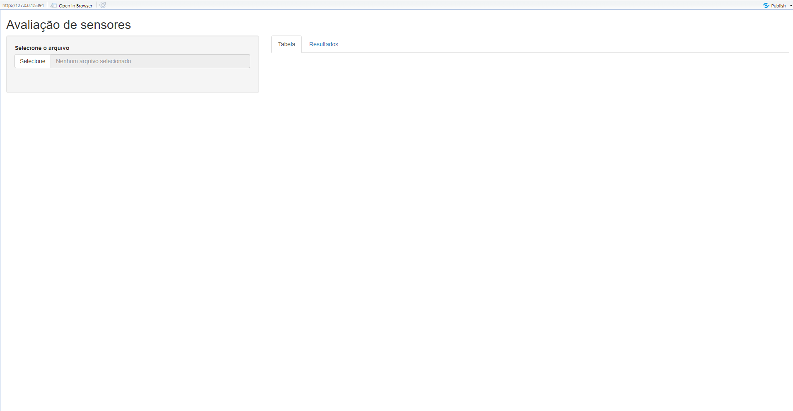
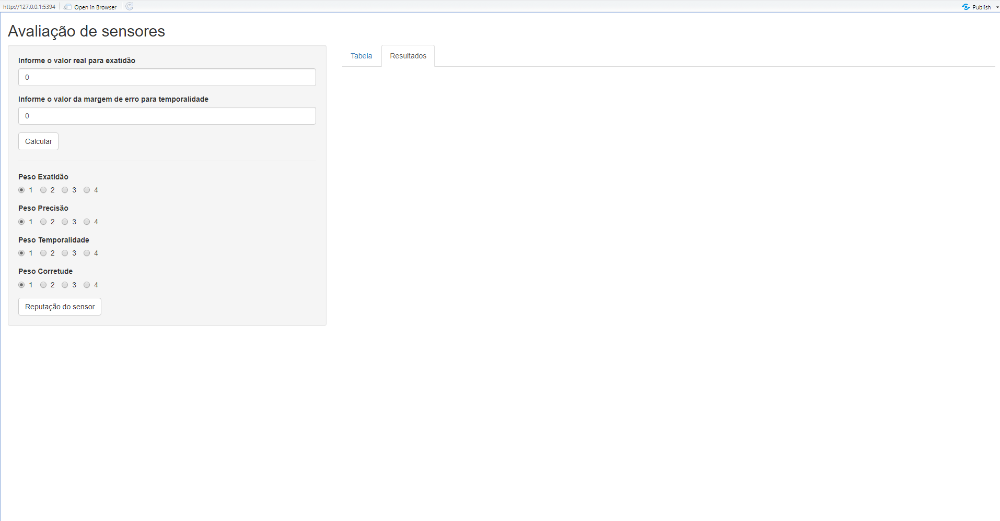

<h1 align="center">UMA PROPOSTA DE CLASSIFICAÇÃO DA QUALIDADE DE SENSORES ANALISADOS POR MEIO DA LINGUAGEM R</h1>

 <a href="#funcionalidades">Funcionalidades</a> •
 <a href="#layout">Layout</a> • 
 <a href="#pre-requisitos">Pré-Requisitos</a> • 
 <a href="#como-executar">Como executar o projeto</a> • 
 <a href="#tecnologias">Tecnologias</a> • 
 <a href="#autor">Autor</a>  

## Sobre o projeto

Esse projeto foi desenvolvido como trabalho de conclusão de curso da graduação de bacharelado em Sistemas de Informação pelo IFES - Campus Colatina. Foi utilizado métodos estatísticos para analisar um conjunto de dados coletados por dois sensores em uma sala de processamento de dados, através da linguagem R.

---

<h2 id="funcionalidades">Funcionalidades</h2>

Foi desenvolvido uma aplicação web interativa, onde se possui duas abas.

- A aba denominada Tabela é onde será selecionado o arquivo com os dados e a exibição desses dados em uma tabela.

- A aba denominada Resultados é onde será feito a interação com a aplicação.

---

<h2 id="layout">Layout</h2>

  
     

---

<h2 id="pre-requisitos">Pré Requisitos</h2>

Antes de executar a aplicação, é necessário realizar o download de dois arquivos aqui presentes, denominados **Sensor DS18B20.xlsx** ou então o arquivo **Sensor NTC.xlsx**. Sendo o primeiro arquivo, os dados do sensor digital e o segundo o do sensor analógico.

Esses são os arquivos bases para realizar os testes.

---

<h2 id="como-executar">Como executar a aplicação</h2>
O projeto pode ser executado através do link abaixo.

-   **[Aplicação](https://jfrancodardengo.shinyapps.io/tcc-application/?_ga=2.55204655.549719145.1638399678-2056294779.1638311695)**

Caso opte em realizar em máquina local, deverá ser feito o download do arquivo **aplicacao.R** disponível nesse repositório.

OBS: para executar esse aplicativo, é necessário fazer o download dos programas presentes no tópico de tecnologias.

---

<h2 id="tecnologias">Tecnologias</h2>

As seguintes ferramentas foram usadas na construção do projeto:

-   **[R](https://cran.r-project.org/)**
-   **[R Studio](https://www.rstudio.com/)**
---

<h2 id="autor">Autor</h2>

Feito por **José Augusto Franco Dardengo**  
👋🏽 Entre em contato!

 
